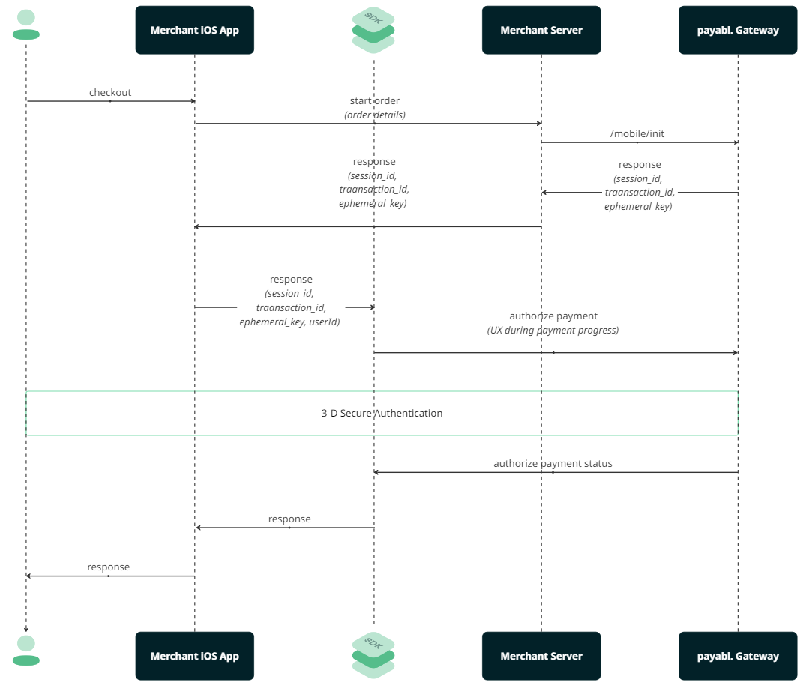

# PayabalMerchant

Welcome to the `PayabalMerchant` repository! This repository contains the SDK for integrating Payabal Merchant services into your iOS applications. Whether you're using SwiftUI or UIKit, this guide will help you get started with the integration.

## Table of Contents

- [Installation](#installation)
  - [Swift Package Manager (SPM)](#swift-package-manager-spm)
- [Integration Guide](#integration)
  - [SwiftUI](#swiftui)
  - [UIKit](#uikit)
- [Flow Diagram](#flow-diagram)
- [Contributing](#contributing)
- [License](#license)


## Installation

### Swift Package Manager (SPM)

To install the SDK, follow these steps:
1. In Xcode, select File > Add Packages… and enter https://github.com/payabl-plugins/payablMerchant-iOS as the repository URL.
2. Select the latest version number from our [releases page](https://github.com/payabl-plugins/payablMerchant-iOS/releases)


## Integration

#### 1. Server-side

This integration requires endpoints on your server that talk to the Payabl API. Use our official libraries for access to the Payabl API from your server:

// TODO: Require assistance from BE on how to integrate server to server

#### 2. Add an endpoint

Your app should reach out to your server to start a payment session from payabl server, note that
for security reasons your app can't directly communicate with payabl server.

Payabl server will return 
  - Session id
  - Transaction id
  - Ephemeral key
  
This data should be returned to the mobile client to initate `PayablPaymentPage` or `PBLApplePay`


### 3. Import the package in your Swift file:

       import PayabalMerchant

### **SwiftUI**
To use PayabalMerchant in a SwiftUI project:

### Integrate Payabl payemnt page 

Example usage:
```
    class DemoCartViewModel: ObservableObject {
      @Published var paymentPage: PBLPaymentPage?
      let backendCheckoutUrl = = URL(string: "backend_endpoint/payment_page")!

      func preparePaymentPage() {
        var request = URLRequest(url: backendCheckoutUrl)
        request.httpMethod = "POST"
        let task = URLSession.shared.dataTask(with: request, completionHandler: { [weak self] (data, response, error) in
        guard let data = data,
              let json = try? JSONSerialization.jsonObject(with: data, options: []) as? [String : Any]
        else { return }
        let sessionId = json["sessionId"]
        let transactionId = json["transactionId"]
        let ephemeralKey = json["empheralKey"]
        let merchantId = json["merchantId"]
        
        
        let config = PBLConfiguration(
          sessionId: sessionId,
          transactionId: transactionId,
          ephemeralKey: ephemeralKey,
          merchantId: merchantId,
          customerId: currentUser.shared.email, // any customer identifer can work
          environment: .sandbox
        )
        self.paymentPage = PBLPaymentPage(configuration: config)
      }
    }
    
    func didFinishCheckout(result: PBLPaymentResult) {
      switch result {
      case .canceled:
        print("Client has canceled the checkout proccess")
      case .completed:
        print("Client has successfuly completed checkout")
      case .failed(let error):
        print("Failed due to: ", error.localizedDescription)
      default:
        fatalError()
      }
    }
  }
  
  struct ContentView: View {
    let demoCartViewModel = DemoCartViewModel()
    var body: some View {
        VStack {
          PBLPaymentButton(paymentPage: demo.paymentPage) { result in
            demoCartViewModel.didFinishCheckout(result: result)
          } content: {
            Text("Checkout")
              .padding()
          }
        }
        .foregroundStyle(.white)
        .background(.black)
        .clipShape(RoundedRectangle(cornerRadius: 10))
        .padding()
        .onAppear { demoCartViewModel.preparePaymentPage() }
    }
  }
```

### Integrate Payabl. Apple Pay button

Example usage:
```
    class DemoCartViewModel: ObservableObject {
      let backendCheckoutUrl = = URL(string: "backend_endpoint/payment_page")!
      var pblApplePayLate: PBLApplePay?
      @Published var pblApplePayLoaded: Bool = false
    
    func prepareApplePay() async -> PBLConfiguration? {
      guard let pblData = await startOrder() else { return nil }
      Task { @MainActor in
        pblApplePayLateLoaded = true
      }
      return PBLConfiguration(
        sessionId: pblData.sessionId,
        ephemeralKey: pblData.ephemeralKey,
        customerId: "",
        environment: isProduction ? .live : .sandbox,
        transactionId: pblData.transactionId,
        appleMerchantId: "merchant.payabl.isdk"
      )
  }
    
    func didFinishCheckout(result: PBLPaymentResult) {
      switch result {
      case .canceled:
        print("Client has canceled the checkout proccess")
      case .completed:
        print("Client has successfuly completed checkout")
      case .failed(let error):
        print("Failed due to: ", error.localizedDescription)
      default:
        fatalError()
      }
    }
  }
  
  extension CartViewModel: PBLApplePayTapDelegate {
    func applePayTapped(onLoadSessionCompleted: @escaping (PBLConfiguration, any PBLErrorDelegate) -> Void) {
      Task {
        // Load payment session then pass configuration and error delegate
        guard let config = await prepareApplePay() else { return }
        onLoadSessionCompleted(config, self)
      }
    }
  }
  
  struct ContentView: View {
    let demoCartViewModel = DemoCartViewModel()
    var body: some View {
      HStack {
        if cartVM.pblApplePayLoaded {
          cartVM.pblApplePay?.button.frame(maxWidth: 200)
        }
      }
      .onAppear {
        Task {
            cartVM.pblApplePay = PBLApplePay(style: .whiteOutline, delegate: cartVM)
            cartVM.pblApplePayLoaded = true
        }
      }
    }
  }
```
### **UIKit**

To use PayabalMerchant in a UIKit project:

1. Import the package in your Swift file:

```swift
   import PayabalMerchant
```

Example usage:

```swift
    class ViewController: UIViewController {
        let pblPaymentPage: PBLPaymentPage?
        override func viewDidLoad() {
            super.viewDidLoad()
            
            let checkoutButton = UIButton(type: .system)
            checkoutButton.setTitle("Checkout", for: .normal)
            checkoutButton.setTitleColor(.white, for: .normal)
            checkoutButton.backgroundColor = .blue
            checkoutButton.layer.cornerRadius = 8
            checkoutButton.titleLabel?.font = UIFont.boldSystemFont(ofSize: 18)

            checkoutButton.frame = CGRect(x: 50, y: 200, width: 200, height: 50)
            
            self.view.addSubview(checkoutButton)
            
            checkoutButton.addTarget(self, action: #selector(payableOrder), for: .touchUpInside)
        }

        @objc func payablOrder() {
            var request = URLRequest(url: backendCheckoutUrl)
            request.httpMethod = "POST"
            let task = URLSession.shared.dataTask(with: request, completionHandler: { [weak self] (data, response, error) in
            guard let data = data,
                  let json = try? JSONSerialization.jsonObject(with: data, options: []) as? [String : Any]
            else { return }
            let sessionId = json["sessionId"]
            let transactionId = json["transactionId"]
            let ephemeralKey = json["empheralKey"]
            let merchantId = json["merchantId"]
            
            
            let config = PBLConfiguration(
              sessionId: sessionId,
              transactionId: transactionId,
              ephemeralKey: ephemeralKey,
              merchantId: merchantId,
              customerId: currentUser.shared.email, // any customer identifer can work
              environment: .sandbox
            )
            pblPaymentPage = PBLPaymentPage(configuration: config)
            pblPaymentPage.present(from: self) { status in
            switch status {
              case .canceled:
                print("Client has canceled the checkout proccess")
              case .completed:
                print("Client has successfuly completed checkout")
              case .failed(let error):
                print("Failed due to: ", error.localizedDescription)
              default:
                fatalError()
              }
            }
        }
    }
```

### Integrate Payabl. payment button

1. Import the package in your Swift file:

```swift
   import PayabalMerchant
```

Example usage:

```swift
    class ViewController: UIViewController {
        let pblPaymentPage: PBLApplePay?
        override func viewDidLoad() {
            super.viewDidLoad()
            
            let checkoutButton = UIButton(type: .system)
            checkoutButton.setTitle("Checkout", for: .normal)
            checkoutButton.setTitleColor(.white, for: .normal)
            checkoutButton.backgroundColor = .blue
            checkoutButton.layer.cornerRadius = 8
            checkoutButton.titleLabel?.font = UIFont.boldSystemFont(ofSize: 18)

            checkoutButton.frame = CGRect(x: 50, y: 200, width: 200, height: 50)
            
            self.view.addSubview(checkoutButton)
            
            checkoutButton.addTarget(self, action: #selector(payableOrder), for: .touchUpInside)
        }

        @objc func payablOrder() {
            var request = URLRequest(url: backendCheckoutUrl)
            request.httpMethod = "POST"
            let task = URLSession.shared.dataTask(with: request, completionHandler: { [weak self] (data, response, error) in
            guard let data = data,
                  let json = try? JSONSerialization.jsonObject(with: data, options: []) as? [String : Any]
            else { return }
            let sessionId = json["sessionId"]
            let transactionId = json["transactionId"]
            let ephemeralKey = json["empheralKey"]
            let merchantId = json["merchantId"]
            
            
            let config = PBLConfiguration(
              sessionId: sessionId,
              transactionId: transactionId,
              ephemeralKey: ephemeralKey,
              merchantId: merchantId,
              customerId: currentUser.shared.email, // any customer identifer can work
              environment: .sandbox
            )
            let applePay = PBLApplePay(configuration: config, style: .automatic) { status in
              print(status)
            }
            Task {
              if await applePay.loadSession() && PBLApplePay.deviceSupportsApplePay() {
              let applePayButton = UIHostingController(rootView: applePay.button)
              addChild(swiftUIButton)
              view.addSubview(swiftUIButton.view)
              applePayButton.didMove(toParent: self)
              applePayButton.view.translatesAutoresizingMaskIntoConstraints = false
              NSLayoutConstraint.activate([
                  applePayButton.view.centerXAnchor.constraint(equalTo: view.centerXAnchor),
                  applePayButton.view.centerYAnchor.constraint(equalTo: view.centerYAnchor)
              ])
            }
        }
    }
```

## Flow diagram



## Additional Features

[List and briefly explain any additional features of PayabalMerchant]

## Troubleshooting

[Common issues and their solutions]

## License

PayabalMerchant is released under the MIT license. See [LICENSE](LICENSE) for details.
